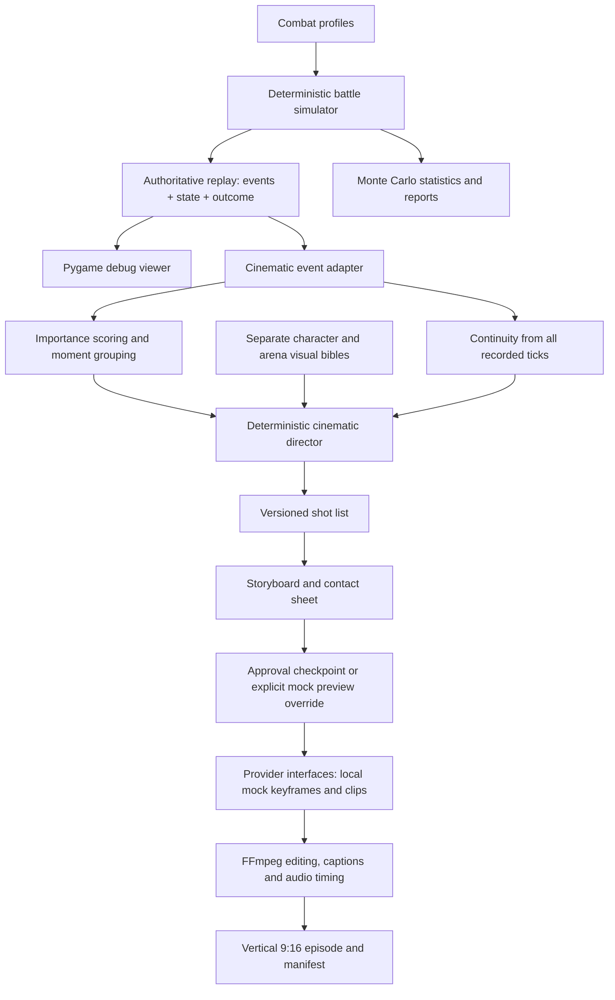

# WhoWouldWin Simulator

## Current source-readiness milestone

Production fight work is paused at Decision C because the independent diagnostic
Actions cannot produce convincing paired martial-arts motion. The current derived
scene is `outputs/combat_motion_lab_source_readiness/scene.blend`. It preserves the
rejected review motion as evidence and adds an import-ready paired-performance
contract plus inactive retarget-cleanup controls. It does not claim to improve the
visible animation.

The importer accepts one synchronized two-actor `.blend`, `.fbx`, `.glb`, or
`.gltf` source, retains a common timeline, uses explicit per-actor rig adapters,
and separates body motion from cinematic root trajectories. Validation requires
partner-relative contact ranges, support/heel/ball/toe phases, usable adapters,
and documented commercial rights. A generated synthetic fixture proves the file
and retarget path only; it is explicitly rejected as production animation.

See the [source requirements](outputs/combat_motion_lab_source_readiness/SOURCE_REQUIREMENTS.md),
[import guide](outputs/combat_motion_lab_source_readiness/PAIRED_ANIMATION_IMPORT_GUIDE.md),
and [acceptance checklist](outputs/combat_motion_lab_source_readiness/ACCEPTANCE_CHECKLIST.md).
The project cannot pass the production animation gate until an actual paired
authored or paired-mocap source is supplied, retargeted, and approved from
normal-speed review renders.

## First character-directed Blender fight

The earlier visual milestone is an 18-second stylized Naruto vs Omni-Man cinematic
excerpt in `outputs/first_production_fight/`. It uses package-backed recognizable
characters, fourteen character-specific Blender Actions, separated procedural root
motion, contact IK, a modular city street, staged destruction, twelve cinematic
cameras, and a layered Rasengan presentation. The saved seed-69 event log remains
the authority for hits, misses, knockback and outcome; the Blender scene only
interprets those events.

### Combat Motion Lab

`outputs/combat_motion_lab` is a parallel, presentation-only motion review of the current Naruto vs Omni-Man choreography. It drives simple orange/black and red/white debug bodies from the same production rigs, Actions/NLA tracks, roots, IK controls, and deterministic event provenance. Static side, three-quarter, front-diagonal, and top views remove camera and VFX distractions; the cinematic test reuses the existing edit with the same debug bodies.

```bash
# Rebuild the derived scene and render the trajectory-overlay diagnostic
wws render-motion-debug --force

# Render and assemble all five motion-review angles from the saved scene
wws render-motion-review --force
```

The top view shows root, center-of-mass, hand, foot, contact, and velocity paths. The lab is an animation approval tool; it does not alter simulator outcomes or source event facts. See [the motion review](outputs/combat_motion_lab/motion_lab_review.md).

Rebuild and render the fast 360×640 preview:

```bash
/Applications/Blender.app/Contents/MacOS/Blender \
  --background outputs/blender_combat_v4_humanoid/scene.blend \
  --python-exit-code 1 \
  --python scripts/blender_first_production_fight.py -- --render-preview
```

Add `--render-quality` to also render the 720×1280 animation-review version. The
quality preview is intentionally a high-resolution Workbench/material render so a
full 540-frame direction pass stays fast. Selected Eevee look-development frames
can be rendered with `scripts/render_first_quality_review.py`.

Simulate autonomous fictional-character battles in Python, then turn a completed battle into a **cinematic shot list, storyboard and vertical mock video**. The production direction is a sequence of deliberately composed shots with future image-to-video providers. Pygame remains a simulation debugger. The earlier Unity experiment is preserved separately.

**The battle simulator determines canonical simulation events. The cinematic renderer is an interpretation layer. Generated visuals are not additional evidence for a matchup outcome.** Starter combat values and visual bibles are clearly labelled development fixtures, not researched claims about fictional characters.

## What works

- The existing deterministic engine, utility AI, four starter profiles, combat mechanics, Monte Carlo statistics and replay verification remain unchanged.
- A normalized event adapter preserves source IDs, tick states, damage and the exact saved outcome.
- Configurable importance scoring groups related events and selects moments; a deterministic director creates 15–35 varied shots with exact frame budgets.
- Continuity follows every recorded tick, including omitted events, with separate visual bibles and arena fixtures.
- Local mock storyboards, a contact sheet, mock keyframes, actual H.264 shot clips, captions, timed placeholder sound effects and FFmpeg assembly work end to end.
- Versioned manifests, per-shot approval, rejection, revision and cached rendering support review and regeneration.
- A short golden-sequence workflow adds explicit ability visuals, multi-shot coverage, shared style/reference packs, and opt-in official Runway image/video adapters. Exact keyframe approval separates image generation from animation.
- Mock remains the default and spends no API credits. Runway contracts are tested offline; no paid generations were run during development.

## Golden sequence: first short visual-quality test

The new workflow extracts **21.80–22.55 seconds of the existing seed-69 replay** into **seven shots / 10 seconds / 720 × 1280 / 30 fps**. A preceding Naruto strike leads into the recorded projectile finisher and Omni-Man’s defeat. Six views cover the same finishing event; they do not add attacks or damage.

```bash
source .venv/bin/activate
python -m pip install -e '.[dev,video,runway]'
wws golden-sequence outputs/naruto_vs_omniman_mock_demo \
  --output outputs/golden_sequence --duration 10 --shots 7 --mock
```

Watch `outputs/golden_sequence/final/golden_sequence.mp4`. This is a **local placeholder preview**, not a real generated-art quality result. The Runway workflow is implemented but deliberately stops before paid use: you supply local references and credentials, explicitly generate keyframes, review/approve them, then explicitly animate.

See [the golden-sequence guide](docs/golden-sequence.md) for exact reference, credential, cost-estimate, keyframe, approval, animation and assembly commands. Default one-pass generation is estimated at **$1.89 before tax** for seven images and seven five-second Gen-4 Turbo clips; a cumulative `$2.00` application cap is suggested. Check provider prices before paid use. [Runway pricing](https://docs.dev.runwayml.com/guides/pricing/)

## Blender 3D combat proof

The Blender backend is a separate, reusable 3D presentation path: an existing replay supplies canonical event facts, deterministic choreography compiles generic action/camera/VFX instructions, and a standalone Blender Python runner creates a scene and vertical video. It uses two **generic rigged humanoids**, not fictional-character assets.

```bash
wws blender-plan outputs/naruto_vs_omniman_mock_demo --output outputs/blender_combat_v2
wws render-blender outputs/blender_combat_v2 --preview
```

The motion-quality v2 scene uses one armature-deformed mesh per generic fighter, blended joint weights, hand/foot IK, explicit contact points, nonlinear trajectory primitives, pose holds and motion-synchronized cameras. Preview is a fast 360 × 640 / 30 fps Workbench MP4. The original `blender_poc_final` output remains available for comparison. See [the Blender backend guide](docs/blender-backend.md) and [v2 validation](docs/blender-combat-v2.md).

### Hybrid authored animation V3

V3 makes reusable native Blender Actions/NLA strips the primary source of body motion. Phase-aware time warping, procedural root trajectories, brief contact IK, retargeted bone maps and landing/launch modifiers adapt those clips to the recorded battle. V2 remains the procedural fallback.

```bash
wws render-blender outputs/naruto_vs_omniman_mock_demo \
  --output outputs/blender_combat_v3 --hybrid --preview
```

See [the hybrid animation guide](docs/blender-hybrid-animation.md) and the generated [V2/V3 animation review](outputs/blender_combat_v3/review/hybrid_animation_review.md).

A separate scene-level directing pass is saved in `outputs/blender_combat_v3_astra/scene.blend`, with its 12-second vertical preview in `renders/preview/fight.mp4`. It corrects Fighter B's rotation mode, tightens the cameras, edits the native Actions, revises contact/root timing, and reduces VFX. See [the animation director review](outputs/blender_combat_v3_astra/animation_director_review.md) for reproduction commands, measured checks, and remaining visual limitations. This is cinematic previs, not production-ready animation.

### Continuous-humanoid retargeting V4

V4 preserves the Astra choreography and drives a separate, continuously skinned Blender-native humanoid through the standard rig adapter. Asset-specific target bone names do not enter the combat, Action/NLA, event, or camera systems. The milestone includes a 12-second vertical preview and an uncut, fixed-camera, VFX-free counter-through-landing review.

```bash
/Applications/Blender.app/Contents/MacOS/Blender \
  --background outputs/blender_combat_v3_astra/scene.blend \
  --python-exit-code 1 \
  --python scripts/blender_v4_humanoid.py -- --render
```

See the [production-rig review](outputs/blender_combat_v4_humanoid/review/production-rig-review.md) and [motion contact sheet](outputs/blender_combat_v4_humanoid/review/motion-contact-sheet.png). The body is a self-contained deformation proxy with closed geometry and smooth weights; it is not artist-retopologized character topology and is not production-ready.

### Character packages and production imports V5

V5 moves visible fighters behind a versioned CharacterPackage contract. Packages declare model/armature assets, axes and scale, the authoritative rig map, generic Action compatibility, custom animation overrides, attachments, materials, abilities, VFX, audio hooks, and metadata. Blender imports `.blend`, `.fbx`, `.glb`, and `.gltf` into derived working data without overwriting the source asset.

```bash
wws validate-character assets/characters/v4_evaluation_a
wws suggest-rig-map assets/characters/v4_evaluation_a \
  --output outputs/blender_combat_v5_assets/review/rig_adapter.proposed.json
```

The V5 output uses clean package-local extracts of the V4 evaluation body because no licensed authored humanoid is currently available. This verifies the import/package path without presenting V4 as production art. See the [CharacterPackage guide](docs/character-packages.md) and [V5 integration report](outputs/blender_combat_v5_assets/review/production-asset-integration-review.md).


## Create the mock cinematic demo

From this repository, with Python 3.12+:

```bash
python3 -m venv .venv
source .venv/bin/activate
python -m pip install -e '.[dev,video]'
wws create-video naruto omniman --seed 69 --mock \
  --aspect 9:16 --duration 60 --shots 24 --output outputs/my-first-episode
```

The final file is `outputs/my-first-episode/final/episode.mp4`: **1080 × 1920, 30 fps, 60 seconds**. It is a labelled mock animatic using local silhouettes and camera moves over storyboards. It validates editing, timing and provenance; it is not AI-generated animation. `--mock` explicitly permits a draft preview, and that override is recorded without claiming human approval. The delivered demonstration is `outputs/naruto_vs_omniman_mock_demo/final/episode.mp4`.

For a quick smaller preview, add `--width 360 --fps 15`. `--dry-run` is an alias for the same complete local mock pipeline. No API key or Unity installation is needed. The video extra supplies a local FFmpeg binary; `WWS_FFMPEG` can select an existing one. `wws` and `python -m whowouldwin.cli.main` are equivalent.

See [the cinematic pipeline guide](docs/visual-pipeline.md) for staged approval, individual-shot regeneration, schemas, provider interfaces and known limits. See [the audit](docs/cinematic-audit.md) and [milestone validation](docs/cinematic-validation.md) for what was reused and tested. The old Unity instructions remain in [the experimental renderer guide](docs/unity-experiment.md).

## Installation

Use **Python 3.12 or newer**. This build was tested on macOS with CPython 3.13.1 and Pygame-CE 2.5.8.

```bash
cd whowouldwin-sim
python3 --version
python3 -m venv .venv
source .venv/bin/activate
python -m pip install -e '.[dev,video]'
python -m whowouldwin.cli.main validate
```

The delivered folder already has an installed `.venv`. Activate it with `source .venv/bin/activate` to start using the application. If moving the folder, recreate the virtual environment at its new location.

For the dependency versions used during validation:

```bash
python -m pip install -r requirements-lock.txt
python -m pip install -e . --no-deps
```

On Windows, activate with `.venv\Scripts\Activate.ps1`. A graphical desktop is needed for the visible viewer; `--headless` uses SDL's dummy display for automated checks. Normal statistical runs do not open a window.

## Run a single fight

```bash
python -m whowouldwin.cli.main simulate \
  --fighter naruto --opponent omniman --runs 1 --seed 42 \
  --save-replay replays/fight_001.json --output reports/single
```

This runs the fight, writes reports and chart images, and saves a complete replay. To inspect the AI's reasoning, add `--debug-ai`. Use `--no-charts` when you only need data and text.

## Run 10,000 or more fights

```bash
python -m whowouldwin.cli.main simulate \
  --fighter naruto --opponent omniman --runs 10000 --seed 42 \
  --workers 4 --save-interesting \
  --replay-dir replays/10000 --output reports/10000
```

`--runs 100000` uses the same workflow. There is no artificial 100,000-run cap. The default is one worker; `--workers 0` selects up to 32 available processes. Parallel workers do not necessarily help on a CPU-constrained machine. Progress is printed to stderr; `--quiet` disables progress.

The 10,000-fight validation batch completed in approximately **107 seconds** on this machine, while other validation was also running. Longer matches and different hardware change throughput. Event histories are retained only for selected replay reruns; normal batches keep aggregate counters and one duration per fight. At this measured rate, 100,000 similar fights would take roughly 18 minutes; that is an extrapolation, not a benchmark.

Each report directory contains:

| File | Contents |
| --- | --- |
| `report.txt` | Concise human-readable result |
| `report.json` | Configuration, seed schedule, outcomes, metrics, ability statistics, confidence intervals, event counts, representative seeds |
| `summary.csv` | Per-fighter wins and average damage / remaining health |
| `durations.csv` | Every fight's seed and duration |
| `win_percentage.png` | Outcome percentages |
| `fight_durations.png` | Duration histogram |
| `finishing_methods.png` | Most common finishers per fighter |

Reports include damage dealt and received, most-used and most-successful abilities, finishing abilities, winner remaining health, win conditions, and shortest/longest/mean/median duration. Success means a resolved hit; hit rate is hits divided by committed uses, so interrupted attacks count as unsuccessful uses. Defense and buff abilities are listed as uses, with zero attack hits. Damage is actual health removed, including damage over time, and excludes overkill. Healing can make total damage received exceed starting health.

Confidence intervals measure Monte Carlo sampling error only. They do not measure uncertainty in character scaling. Output files at the same paths are replaced on another run; use separate `--output` and `--replay-dir` directories to retain batches.

## Pygame combat debugger

```bash
python -m whowouldwin.visual.app \
  --fighter naruto --opponent omniman --seed 12345
```

Both fighters start automatically. Geometric silhouettes are placeholders. The viewer shows movement and elevation, health, stamina, energy, attack windups, projectiles, beams, area effects, knockback, dodges, guards, statuses, and forms. The camera fits the combatants. Debug mode adds cooldowns and the score breakdown for each fighter's last chosen action.

| Key | Playback action |
| --- | --- |
| Space | Pause / resume |
| R | Restart the same seed or recording |
| 1 / 2 / 4 | Play at 1× / 2× / 4× |
| 0 | Slow motion at 0.25× |
| Right arrow or period | Pause and advance exactly one simulation tick |
| D | Toggle AI and cooldown debug panels |
| Esc | Close |

No keys control either fighter. To automatically save a live fight when it finishes, add `--save-replay replays/visual.json`. Closing before the fight finishes does not save an incomplete replay.

## Replays and representative fights

```bash
# Re-simulate the embedded profiles and compare every event and state frame.
python -m whowouldwin.cli.main replay replays/fight_001.json

# Play the stored event/state log; no combat re-simulation is needed.
python -m whowouldwin.visual.app --replay replays/10000/upset.json

# Equivalent visual launch through the main CLI.
python -m whowouldwin.cli.main replay replays/10000/upset.json --visual
```

Each replay contains the seed, matchup rules, resolved profile documents, engine/Python versions, final statistics, and a per-tick snapshot with its structured events. A SHA-256 checksum detects accidental editing or corruption; it is not an authenticity signature.

Seed reproduction requires the same engine rules and a compatible numeric runtime. Embedded profiles protect replays from edits to the starter files. **Recorded playback does not execute the engine**, so an existing recording can still be watched when future rules change. Seed verification refuses a different engine version. For exact cross-platform preservation, retain the recorded frames and event log.

`--save-interesting` selects the shortest and longest fights, the winner with the least remaining health (`closest`), the winner with the most remaining health (`dominant`), and a victory by the batch's less frequent winner (`upset`). An upset is omitted if no minority fighter wins or the counts tie. Closest/dominant are omitted if the batch contains only draws. Equal-ranked candidates use the first seed encountered. These are algorithmic examples, not statistically representative samples of every fight.

## Matchup files and overrides

See `data/matchups/naruto_vs_omniman.yaml`:

```yaml
fighter_a: naruto
fighter_b: omniman
arena:
  width: 120
  height: 40
starting_distance: 60
rules:
  bloodlusted: false
  timeout: 180
  timestep: 0.05
scaling:
  fighter_a: expected
  fighter_b: expected
seed: 42
```

```bash
python -m whowouldwin.cli.main simulate \
  --matchup data/matchups/naruto_vs_omniman.yaml \
  --runs 1000 --seed 99 --scaling-a high --timeout 120
```

CLI values override corresponding file values. Available overrides include fighter, opponent, seed, starting distance, width, height, timestep, timeout, `--scaling-a`, `--scaling-b`, `--bloodlusted` / `--no-bloodlusted`, and `--lethal` / `--no-lethal`. These configuration options also work for a live visual fight. A recorded replay always uses its stored configuration.

## Architecture



| Package | Responsibility |
| --- | --- |
| `characters`, `combat`, `ai` | Existing battle profiles, mechanics and utility AI; unchanged |
| `simulation` | Tick engine, recording, parallel batches and replay integrity; unchanged |
| `analytics` | Statistics and reports; unchanged |
| `visual` | Preserved Pygame debug renderer, also launched by `wws debug-view` |
| `cinematic/episodes` | Event adapter, selector, director, continuity, storyboard, providers, editor, project manifests and CLI |
| `data/visual_bibles`, `data/arena_visuals` | Appearance and arena fixtures, separate from combat values |
| `cinematic` legacy modules, `unity/WhoWouldWinVisual` | Earlier continuous Unity rendering experiment, retained but not required |
| `cli` | Existing commands plus additive episode command registration |

Dependencies point from the cinematic subsystem toward the simulator, never from the simulator toward cinematic code. `Engine.step()` / `World.snapshot()` remain the live debugger boundary; a completed checksummed replay is the shot pipeline boundary. Selected shots never alter damage, health, timing, seed, AI or winner. The episode's presentation duration can differ from the fight's simulated duration.

## Combat units and timing

Coordinates are meters in an arcade arena; velocity is meters per second; acceleration is meters per second squared. Gravity defaults to 28. Collision radius is 1 meter. Health, stamina, and energy are gameplay resource units. Strength, striking power, and durability are positive comparative gameplay quantities with a reference near 100, not a maximum of 100. Combat/reaction speed are positive multipliers around 1. Accuracy, evasion, blocking, aggression, battle IQ, risk, and resistances are proportions. Mass is a gameplay kilogram estimate that scales knockback. Physical stamina scales stamina recovery.

Physical quantities accept either a positive scalar or `{ "low": 85, "expected": 100, "high": 115 }`. The selected scenario is fixed for that fighter throughout a run. This is explicit scenario selection, not random uncertainty sampling. Resistance values range from -1 (double damage before other modifiers) to 0.95 (95% reduction).

Each tick expires cooldowns/statuses and regenerates resources, lets both ready fighters perceive the pre-commit world, chooses actions, commits them in reaction-based initiative order, moves fighters, resolves due actions and swept projectiles, applies effects, then checks victory. AI reconsiders when recovery and its reaction delay allow it. Startup is quantized upward to a whole tick. All attacks have a single impact/release; `active` also contributes to action occupancy and visual duration. Multi-hit combos and sustained beam channels are future extensions. Projectiles lead current target velocity according to battle IQ and then travel without homing. Ground-targeted area attacks lock their center at commitment; self-centered bursts follow the caster at release.

Resource spending and cooldowns begin at commitment, even if the action is interrupted. Stun lasts at most 1.5 seconds and grants 1.2 seconds of subsequent stun immunity. Flight is temporary, costs energy, and chooses a tactical altitude; it cannot flee indefinitely above combat. Arena edges clamp motion, and overlaps are separated. There is no destructible terrain in V1.

Zero health produces KO by default or `death` with lethal rules. Continuous `incapacitated` status reaches victory after the configured duration (default 3 seconds). Stun alone does not automatically award an incapacitation victory. Attacks released together can trade and cause mutual KO. All timeouts are draws; the engine does not award a points decision. Timeout rounds up to the next tick if it is not divisible by the timestep.

## Utility AI

Legal actions must satisfy cooldowns, resources, distance envelopes, mobility capability, form requirements, health conditions, and optional target-status requirements. The AI compares each against a small rest/reposition baseline.

For an attack, the main damage term is expected damage times hit probability, divided by commitment time and a reference damage scale. Scores also incorporate preferred distance, enemy windup/stun, likely finishers, current incoming threats, survival value, special-ability preference, resource scarcity, startup risk, recent repeated actions, and personality. A bounded random perturbation breaks rigid patterns. Every perturbation uses the fight's private seeded RNG. The chosen action's score components and strongest rejected score are stored for debugging. No LLM or network call runs in a tick.

Movement continuously steers toward a preferred range. When energy is insufficient for ranged options, the fighter closes toward an affordable attack's range. Bloodlusted rules raise aggression/risk tolerance and favor close pursuit; they do not change damage values.

## Damage calculation

Before hit variance and defense:

```text
damage = ability_damage
       × ((attack_power + 20) / (defender_durability + 20)) ** 0.45
       × (1 - resistance)
       × shield_multiplier
```

Attack power uses striking power, or the mean of strength and striking power for grapples. Forms and power statuses modify the input stats. A shield's multiplier is `1 / (1 + magnitude)`. The sublinear exponent softens scale differences while allowing a weaker attacker to deal positive damage. No defense subtraction can produce negative damage.

Resolution uses seeded damage variation in `[0.88, 1.12]` and optional 1.5× critical hits. Hit probability depends on accuracy, evasion, combat/reaction speed, fatigue, vulnerability, decoys, ability modifiers, and grapple skill; it is clamped to `[0.08, 0.97]`. Active dodges have an 88% avoidance check. Active blocks reduce damage by `0.8 × blocking`, spend additional stamina, and suppress on-hit control effects; grapples bypass blocking. Resistance, shield and block reductions combine multiplicatively. Damage is clamped to remaining health. Regeneration never revives a defeated fighter.

## Add a character or ability

Copy one of `data/characters/*.json`, set a unique identity ID and explicit version/scaling note, and edit its values. JSON is the default filename lookup; YAML profiles can also be loaded by passing their file path.

```bash
python -m whowouldwin.cli.main validate
python -m whowouldwin.cli.main simulate --fighter data/characters/my_fighter.json --opponent aang --runs 10
```

The full machine-readable schema is `docs/character.schema.json`; the Python definition is `characters/schema.py`. Unknown keys, invalid ranges, nonfinite values, duplicate abilities, impossible costs, and missing transformation references are rejected.

Reusable ability definitions choose one of the supported types and specify timing, costs, damage/range, optional status effects and movement, targeting, form requirements, health/target conditions, and a utility multiplier. Example:

```json
{
  "id": "storm_bolt",
  "name": "Storm Bolt",
  "type": "projectile",
  "range": 45,
  "startup": 0.3,
  "active": 0.15,
  "recovery": 0.4,
  "cooldown": 2,
  "energy_cost": 12,
  "damage": 75,
  "damage_type": "energy",
  "projectile_speed": 50,
  "knockback": 8,
  "status_effects": [{"id": "slow", "duration": 2, "magnitude": 0.25}],
  "utility": 1
}
```

Available status primitives are `stun`, `slow`, `burn`, `regen`, `decoy`, `power`, `shield`, and `incapacitated`. New combinations of existing mechanics require only data. A fundamentally new mechanic requires extending the validated type/status schema, its shared combat resolver, utility scoring, and focused tests. Add event effects to the viewer as needed; never implement the mechanic in the renderer.

## Testing and validation

```bash
python -m pytest -q
python scripts/validate_matchups.py
python -m whowouldwin.visual.app --headless --auto-quit --speed 4 \
  --screenshot reports/visual-smoke.png
```

The test suite exercises deterministic events/state, seed diversity, resource bounds, cooldowns, startup timing, movement/collision, flight/jump, projectiles, dodges, blocks, grapples, knockback, stun immunity, transformations, regeneration, death/KO/incapacitation/timeout, replay checksums, serial/parallel parity, report files and charts, both visual paths, and a 1,000-fight smoke batch. `pytest -m 'not slow'` skips the thousand-fight check only. See `VALIDATION.md` for earlier simulator benchmarks and [cinematic validation](docs/cinematic-validation.md) for this milestone. The episode tests cover event adaptation, grouping, frame budgets, continuity, approval/revision, local providers, real FFmpeg output, and unchanged seeded outcomes.

The validation script runs the four requested 1,000-fight pairings with the full 180-second timeout, writes reports, saves interesting fights, verifies every representative replay, and records event totals in `reports/validation_summary.json`. It does not adjust character stats to force 50/50 outcomes.

## Limits and next development

Combat still models two circular bodies in an empty 2D arena. Decoys modify evasion rather than spawning independent clone agents; grapples are short control attacks; beams resolve as instantaneous ranged hits after startup. Multi-hit simulation combos, destructible terrain, canonical feat research and teams are future engine work. Physical `reach` is reserved metadata; ability range controls attack reach.

The delivered previews use deterministic mock storyboards and local camera motion. Opt-in Runway adapters now support real footage, but their visual quality and live account behavior await the first user-initiated paid test. Environment architecture and lighting are visual fixtures; persistent destruction is not inferred from explosions. Wear is a labelled presentation convention from the lowest recorded health fraction, with no invented anatomical injury or costume tear. Tick snapshots bracket an event; they do not supply exact intermediate anatomy or poses. Camera motion prompts support richer movements than the mock provider's pan/zoom stand-ins.

The next five improvements are:

1. Supply consistent reference images and run the seven-keyframe review with the explicit budget cap.
2. Animate only approved keyframes and inspect identity, costume, action direction and single-contact continuity.
3. Choose the best interval from each preserved full clip; regenerate only rejected shots.
4. Refine ability descriptions, reference boards and coverage from this real ten-second quality test.
5. Expand to 30–60 seconds only after the short result is compelling; add stronger output QA and sound design then.

[docs/extension-points.md](docs/extension-points.md) preserves future database, research, teams and simulator integration boundaries. None of those dependencies are introduced by the cinematic milestone.
