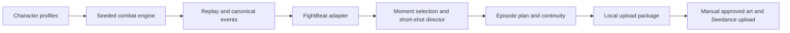

# WhoWouldWin Simulator

WhoWouldWin runs seeded, autonomous fictional-character fights and turns a saved fight into a **local, Seedance-ready short-shot planning package**. The Python simulator determines the outcome and event order. The visual pipeline interprets those facts; generated imagery is never evidence for a matchup claim. Starter values and visual designs are development fixtures, not researched power-scaling claims or licensed art.

The active visual workflow is now **2D/stylized manual image-to-video production**, not Blender. Existing Blender scenes, scripts, CharacterPackages, Pygame debug playback, mock videos, reports and tests are preserved as historical work; they are not needed to prepare a Seedance package. The former README is archived in [docs/legacy-production-workflow.md](docs/legacy-production-workflow.md).


```mermaid
flowchart LR
    A[Character profiles] --> B[Seeded combat engine]
    B --> C[Replay and canonical events]
    C --> D[FightBeat adapter]
    D --> E[Moment selection and short-shot director]
    E --> F[Episode plan and continuity]
    F --> G[Local upload package]
    G --> H[Manual approved art and Seedance upload]
```

## Install and validate

Use Python 3.12 or newer. The Seedance preparation path calls no paid API and requires no Blender installation. `ffmpeg` and `ffprobe` are optional for extracting private stills and probing the two supplied visual references.

```bash
cd /Users/jacksonjue/Documents/Codex/2026-09-04/you-are-building-a-complete-working-2/whowouldwin-sim
python3 -m venv .venv
source .venv/bin/activate
python -m pip install -e '.[dev]'
python -m whowouldwin.cli.main validate
python -m pytest -q
```

The repository's existing `.venv` may already be installed. `wws` and `python -m whowouldwin.cli.main` are equivalent. The active package runs without `bpy`, Blender, credentials, Seedance, or an external video provider.

## Create a fight and Seedance planning package

From the repository root:

```bash
wws simulate --fighter naruto --opponent omniman --runs 1 --seed 69 \
  --save-replay replays/seedance_seed69.json --output reports/seedance_seed69
wws prepare-seedance replays/seedance_seed69.json --duration 10 --shots 8
```

Or run and package directly from a matchup seed:

```bash
wws prepare-seedance naruto omniman --seed 69 --duration 10 --shots 8
```

The result is `outputs/seedance_ready/<episode_id>/`. It includes `simulation.json`, one `FightBeat` per canonical event, an editorial timeline, continuity states, visual bibles, ability specifications, an eight-shot plan, storyboard text, per-shot prompts and negative prompts, upload manifests, and strict validation. Each shot is 0.5–3 seconds, with one dominant recorded action. The default canvas is 9:16, 1080×1920 at 30 fps; the editorial plan is 8–15 seconds with 6–12 shots. Shot references point back to source event IDs and the event-log SHA-256.

The generated `first_frame/blocking.svg` and `last_frame/blocking.svg` are **schematic placement diagrams**. They are deliberately not character art or upload assets. The pipeline never substitutes synthetic artwork for missing references.

For repeated character, style and ability references, place each approved image once under `shared_references/` using `shared_reference_requirements.json`, then run `wws seedance-stage-refs outputs/seedance_ready/<episode_id>`. The command copies only valid images into the shot folders. The curated first episode already bundles these images and uses one shot-specific `keyframe.png`; optional end frames can be added after continuity review. Generic packages still support approved first and last frames.

```bash
wws seedance-missing outputs/seedance_ready/<episode_id>
wws validate-seedance outputs/seedance_ready/<episode_id>
```

Both validation commands exit with status 2 while required assets are missing. Each shot's `upload_manifest.json` lists the exact images to upload. The JSON batch manifest uses an absolute project root and portable relative paths inside it. The curated first episode validates with zero missing files; use its `seedance-manual-upload-guide.md` and human review checklists. No automatic Seedance API integration or paid video generation exists.

The first reference analysis is under `outputs/seedance_ready/reference_analysis/`. The two supplied example videos are used only for visual study. Extracted frames stay in `private_reference_frames/`, outside distributable shot folders; do not upload or publish them. The source recordings include social-app UI and letterboxing, which the WWS full-frame 9:16 output does not reproduce.

### First curated episode

The seed-69 Naruto versus Omni-Man package includes 18 selected graphic reference images and one reviewed vertical keyframe for each of eight shots. The source art is tracked under `assets/seedance/first_episode/`; preparation copies it into the local output without overwriting later human replacements. Run the three commands above in order; the saved replay, generated prompts, exact source-beat IDs, image inventory and manual guide are written to `outputs/seedance_ready/naruto_vs_omniman_seed69_ff4f81ae/`. The validation command checks image decoding, keyframe aspect ratio, prompt and continuity correspondence, fighter-reference assignment, source order, replay checksum, event hash and outcome. A final human review of the generated art and Seedance motion remains necessary before publication.

The suggested punch → slip → parry → hand-contact Rasengan sequence was not the recorded seed-69 fight. The curated episode therefore preserves the saved order: charged-vortex projectile hit, grapple dodge, heavy-strike block, chakra transformation, Omni-Man charge hit, energy-orb projectile KO, and aftermath. See `source-truth-note.md` in the output. Rasengan is a hand-delivered attack; the charged-vortex projectile has a Rasenshuriken-like visual, while the finishing Energy Orb stays a generic placeholder projectile. Neither is called a thrown Rasengan.

### 62-second directed seed-289 episode

The separate long-form package expands the saved 7.55-second seed-289 fight into **62 editorial seconds across 28 image-backed shots and five sequences**. Its real combat outcome is Omni-Man's heavy-strike KO. A late failed Rasengan attempt is clearly labeled **noncanonical editorial staging**: the rotating sphere stays in Naruto's hand, never becomes a projectile, and causes no hit or damage. The recorded charged-vortex projectile is Rasenshuriken-like; the separate generic Energy Orb is a small straight pellet with no spiral.

```bash
wws prepare-seedance-longform
wws finalize-seedance-longform outputs/seedance_ready/naruto_vs_omniman_60s
wws validate-seedance outputs/seedance_ready/naruto_vs_omniman_60s
```

The saved replay and 28 keyframes are versioned in `assets/seedance/seed289_60s/`; the output is regenerated locally. The finalizer checks the existing art without replacing it, corrects shot 028's end hold, and refreshes the inventory and pre-upload audit. Inspect `review/keyframe_camera_contact_sheet.jpg`, `review/preupload_audit.json`, `production_readiness.md`, `camera_grammar.md`, each `upload_manifest.json`, and the sibling `outputs/seedance_ready/naruto_vs_omniman_production_review.md`. The shots deliberately alternate wide, overhead, ground-level, profile, three-quarter, over-the-shoulder and close angles while holding one understandable fight axis. All required reference files are present, but a valid upload package does not guarantee good generated motion. Make and approve clips one at a time; review the first five at normal speed before comparing quality with the supplied examples. No paid provider or final video is invoked by these commands.

### Dreamina Seedance 2.5 five-sequence test

```bash
wws prepare-seedance25
wws validate-seedance25 outputs/seedance_ready/naruto_vs_omniman_seedance25
```

This additive package keeps the 28-shot plan in `internal/` but exports five connected sequence folders totaling 62 seconds. Each has opening/ending frames, a lightweight 2D motion-reference video, prompts, continuity and a restrained reference manifest. The shared set has exactly 12 flat graphic boards instead of the old detailed per-shot art. The locally drawn animatics communicate blocking and camera movement; they are not generated fight footage. Read `seedance25_manual_workflow.md` in the output, then test **sequence 01 only** in Dreamina before generating the rest. Naruto's editorial Rasengan attempt remains a hand-held melee entry that misses; Omni-Man's recorded heavy strike remains the decisive KO. No Blender or paid video service is called by this preparation command. Local package validation does not establish generated-motion quality or sample-video parity.

For a faster edit with more distinct combat clips, keep the first package and build its standalone derivative:

```bash
wws prepare-seedance25-v2
wws validate-seedance25-v2 outputs/seedance_ready/naruto_vs_omniman_seedance25_v2
```

This version covers the same canonical 28-shot plan in **nine sequences totaling 60 seconds** (5, 7, 7, 7, 7, 7, 6, 7, 7 seconds). The longest generation falls from 18 to 7 seconds. The recorded flight hit, wind-shuriken miss, heavy reply, jab slip, Energy Orb hit, grapple, block, second charge, failed hand-held Rasengan entry and final KO receive their own compact action windows. `review/pacing_comparison.md` explains the edit. No additional damaging action or altered result is introduced. As with the first package, validate locally, then generate and review sequence 01 at normal speed before spending credits on the rest.

For simpler character artwork closer to the supplied private example and visibly varied camera views, build the standalone v3 derivative:

```bash
wws prepare-seedance25-v3
wws validate-seedance25-v3 outputs/seedance_ready/naruto_vs_omniman_seedance25_v3
```

V3 preserves the same nine sequences, 60-second target, event hash and Omni-Man KO. It includes ten original, minimal 2D image references and nine guides with cuts between low, side, overhead, high, over-the-shoulder and three-quarter compositions. Inspect `review/motion_camera_contact_sheet.jpg`, `review/episode_motion_animatic.mp4`, and `camera_plan.json`. The private example recording is not bundled or copied. These locally rendered guides explain body spacing and camera rhythm; actual Seedance motion and identity stability are unverified until sequence 01 is generated and reviewed at normal speed. Naruto's editorial Rasengan stays in his hand and misses; the wind shuriken and Energy Orb are separate projectile abilities.

## Simulator commands

```bash
wws simulate --fighter naruto --opponent omniman --runs 10000 --seed 42 \
  --output reports/naruto_vs_omniman --save-interesting
wws replay replays/seedance_seed69.json
wws validate
python -m whowouldwin.visual.app --fighter naruto --opponent omniman --seed 69
```

The statistical runner produces win rates, durations, finishers, ability usage, damage metrics, JSON/CSV and charts. Saved replays contain the seed and character data; replay verification recomputes the same fight. Pygame remains an optional **debug** view of the authoritative engine. It is not the production renderer. Character profiles are JSON in `data/characters/`; matchup examples are in `data/matchups/`. Add a new profile by following the schema, adding reusable ability definitions, and running `wws validate` before simulating. The engine and utility AI documentation remains in [docs/legacy-production-workflow.md](docs/legacy-production-workflow.md) and the relevant source docstrings.

## Boundaries and next steps

The curated seed-69 package is **technically ready for manual upload**, with zero missing image files. The generated graphic art remains subject to human identity/style approval, and no Seedance animation or final TikTok episode has been generated. Other matchups still require their own approved art. Next: review the eight keyframes at phone size, generate one shot at a time, reject motion or identity drift, then assemble only approved clips. The canonical combat replay remains unchanged. Historical Blender work remains available for reference and does not need to be reopened for this workflow.
