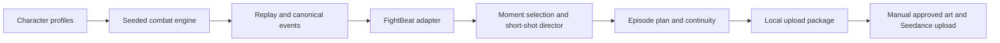

# WhoWouldWin Simulator

WhoWouldWin runs seeded, autonomous fictional-character fights and turns a saved fight into a **local, Seedance-ready short-shot planning package**. The Python simulator determines the outcome and event order. The visual pipeline interprets those facts; generated imagery is never evidence for a matchup claim. Starter values and visual designs are development fixtures, not researched power-scaling claims or licensed art.

The active visual workflow is now **2D/stylized manual image-to-video production**, not Blender. Existing Blender scenes, scripts, CharacterPackages, Pygame debug playback, mock videos, reports and tests are preserved as historical work; they are not needed to prepare a Seedance package. The former README is archived in [docs/legacy-production-workflow.md](docs/legacy-production-workflow.md).


```mermaid
flowchart LR
    A[Character profiles] --> B[Seeded combat engine]
    B --> C[Replay and canonical events]
    C --> D[FightBeat adapter]
    D --> E[Moment selection and short-shot director]
    E --> F[Episode plan and continuity]
    F --> G[Local upload package]
    G --> H[Manual approved art and Seedance upload]
```

## Install and validate

Use Python 3.12 or newer. The Seedance preparation path calls no paid API and requires no Blender installation. `ffmpeg` and `ffprobe` are optional for extracting private stills and probing the two supplied visual references.

```bash
cd /Users/jacksonjue/Documents/Codex/2026-09-04/you-are-building-a-complete-working-2/whowouldwin-sim
python3 -m venv .venv
source .venv/bin/activate
python -m pip install -e '.[dev]'
python -m whowouldwin.cli.main validate
python -m pytest -q
```

The repository's existing `.venv` may already be installed. `wws` and `python -m whowouldwin.cli.main` are equivalent. The active package runs without `bpy`, Blender, credentials, Seedance, or an external video provider.

## Create a fight and Seedance planning package

From the repository root:

```bash
wws simulate --fighter naruto --opponent omniman --runs 1 --seed 69 \
  --save-replay replays/seedance_seed69.json --output reports/seedance_seed69
wws prepare-seedance replays/seedance_seed69.json --duration 10 --shots 8
```

Or run and package directly from a matchup seed:

```bash
wws prepare-seedance naruto omniman --seed 69 --duration 10 --shots 8
```

The result is `outputs/seedance_ready/<episode_id>/`. It includes `simulation.json`, one `FightBeat` per canonical event, an editorial timeline, continuity states, visual bibles, ability specifications, an eight-shot plan, storyboard text, per-shot prompts and negative prompts, upload manifests, and strict validation. Each shot is 0.5–3 seconds, with one dominant recorded action. The default canvas is 9:16, 1080×1920 at 30 fps; the editorial plan is 8–15 seconds with 6–12 shots. Shot references point back to source event IDs and the event-log SHA-256.

The generated `first_frame/blocking.svg` and `last_frame/blocking.svg` are **schematic placement diagrams**. They are deliberately not character art or upload assets. The pipeline never substitutes synthetic artwork for missing references.

For repeated character, style and ability references, place each approved image once under `shared_references/` using `shared_reference_requirements.json`, then run `wws seedance-stage-refs outputs/seedance_ready/<episode_id>`. The command copies only valid images into the shot folders. First and last frames remain shot-specific.

```bash
wws seedance-missing outputs/seedance_ready/<episode_id>
wws validate-seedance outputs/seedance_ready/<episode_id>
```

Both validation commands exit with status 2 while approved assets are missing. Each shot's `upload_manifest.json` lists the exact image paths to supply, including front/side/three-quarter fighter boards, approved style, ability images when needed, and approved first/last frames. The JSON batch manifest uses an absolute project root and portable relative paths inside it. Add rights-cleared images, rerun validation, then follow `seedance_upload_guide.md` to upload shots manually. No automatic Seedance API integration or paid generation exists.

The first reference analysis is under `outputs/seedance_ready/reference_analysis/`. The two supplied example videos are used only for visual study. Extracted frames stay in `private_reference_frames/`, outside distributable shot folders; do not upload or publish them. The source recordings include social-app UI and letterboxing, which the WWS full-frame 9:16 output does not reproduce.

## Simulator commands

```bash
wws simulate --fighter naruto --opponent omniman --runs 10000 --seed 42 \
  --output reports/naruto_vs_omniman --save-interesting
wws replay replays/seedance_seed69.json
wws validate
python -m whowouldwin.visual.app --fighter naruto --opponent omniman --seed 69
```

The statistical runner produces win rates, durations, finishers, ability usage, damage metrics, JSON/CSV and charts. Saved replays contain the seed and character data; replay verification recomputes the same fight. Pygame remains an optional **debug** view of the authoritative engine. It is not the production renderer. Character profiles are JSON in `data/characters/`; matchup examples are in `data/matchups/`. Add a new profile by following the schema, adding reusable ability definitions, and running `wws validate` before simulating. The engine and utility AI documentation remains in [docs/legacy-production-workflow.md](docs/legacy-production-workflow.md) and the relevant source docstrings.

## Boundaries and next steps

The current upload packages are **blocked until real approved reference images are supplied**. The local pipeline is validated, but no Seedance animation or final TikTok episode was generated. The next steps are rights-cleared character/style/ability boards, artist-approved start/end frames, manual shot generation, continuity review, and approved clip assembly. The canonical combat replay must remain unchanged through those stages. Historical Blender work remains available for reference and does not need to be reopened for this workflow.
