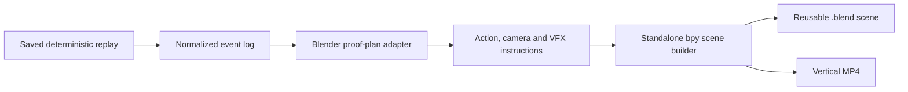

# Blender combat-animation backend

The deterministic simulator remains the authority for who acts, which actions connect, and the outcome. The Blender backend is a presentation layer. It converts normalized cinematic events into a short plan containing root-motion/action instructions, camera cuts and VFX. It does not import combat code, re-simulate attacks, or alter a replay.



## Requirements

Use Blender **4.2 LTS or newer**. Blender 4.5.13 LTS was used to validate the scene here. No add-ons, paid APIs or character downloads are required. The CLI discovers `blender` on `PATH`, `/Applications/Blender.app/Contents/MacOS/Blender`, or the `WWS_BLENDER` environment variable. `--blender /path/to/Blender` overrides discovery.

```bash
source .venv/bin/activate
python -m pip install -e '.[dev,video]'
wws blender-plan outputs/naruto_vs_omniman_mock_demo --output outputs/blender_combat_v2
wws render-blender outputs/blender_combat_v2 --preview
```

The first command writes a self-contained project: `blender_plan.json`, copied `source/events.json`, `scene.py`, `blender_manifest.json`, and output folders. The second builds `scene.blend` and `renders/preview/fight.mp4`. Existing verified MP4s are cached and not rendered again.

For final quality, use Eevee Next at 1080 × 1920:

```bash
wws render-blender outputs/blender_combat_v2 --final
```

Preview is a fast 360 × 640 Workbench render with studio lighting, appropriate for checking poses, camera cuts, timing and VFX placement. Final mode uses Eevee Next, material shading, motion blur and compositor glow. Both are 30 fps, 12 seconds, and contain exactly 360 frames.

## Demonstration choreography

The plan selects the first recorded `AttackDodged` followed by the defender's `AttackHit` and `Knockback` within two simulation seconds. In the supplied seed-69 replay, that is event 000055 (dodge), event 000063 (counter-hit), then event 000065 (knockback). Generic Fighter A and Fighter B replace source character imagery.

The 12-second edit is nine contiguous cuts: faceoff; A dash; B dodge; A overshoot/wall moment; B counter setup; three-frame impact hold; airborne launch; landing; aftermath. The set's wall fracture and dust are explicitly marked `presentation` authority because terrain damage is not modeled by the simulation. They cannot add fighter damage or change the saved outcome.

## Action system

The runtime creates two generic humanoids as single meshes deformed by full armatures. Explicit blended vertex groups and overlapping joint volumes replace the v1 bone-parented pieces. Each rig provides hand contact IK plus two planted-foot IK chains. It has reusable implementations for:

`idle`, `combat_stance`, `dash`, `sprint`, `jump`, `aerial_movement`, `punch`, `heavy_punch`, `kick`, `dodge`, `block`, `hit_reaction`, `knockback`, `launch`, `fall`, `landing`, and `recovery`.

The plan separately records action, start, target, overshoot, recovery, trajectory and contact positions. Root trajectories include stationary, linear/accelerating blitzes, curved approaches, aerial arcs, launches, knockbacks, ground skids, wall impacts and recovery landings. The pose registry includes stance, dash phases, punch phases, dodges, block, light/heavy hits, launch, airborne knockback, wall/ground impact, landing and recovery. The counterpunch hand is solved to its contact target; grounded anticipation and landing use planted-foot controls. Two-to-four-frame holds, squash/stretch root spacing and abrupt acceleration provide intentionally exaggerated timing.

Camera primitives include wide establishing, tracking, orbit, push/pull, close-up, over-the-shoulder, low/high angle, whip pan, impact and knockback tracking. Tracking now lags then catches a blitz, impact framing holds through hit-stop, knockback tracking briefly loses then reacquires the victim, and landing framing descends with the trajectory. Shake is restricted to the relevant motion window rather than running throughout every shot.

## Adding future models and actions

See [the asset directory guide](../assets/blender/README.md). Do not attach a third-party model directly to the generic timeline. Add a rig adapter that maps its root and named controls into the same action contract. Character-specific action clips can override the generic implementation without changing the simulator, source event log or Blender plan schema.

## Validation

```bash
python -m pytest -q
```

Tests cover both schema generations, plan validation, deterministic selection, source event provenance, camera continuity, contact/trajectory requirements, self-contained script generation and missing assets. Blender 4.5.13 LTS created `outputs/blender_combat_v2/scene.blend` and the decoded 360-frame/12-second preview. See [the motion-quality validation](blender-combat-v2.md) for measurements and the v1 comparison. Full-resolution rendering was deliberately left out of this milestone.
