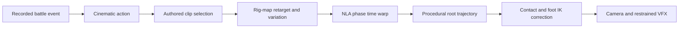

# Hybrid authored and procedural Blender animation

Combat V3 keeps the deterministic simulator and V2 presentation fallback intact. Its schema-v3 path changes the source of body motion: reusable native Blender Actions drive the humanoid pose, while procedural layers adapt those clips to each recorded event.



Run the complete low-resolution path with:

```bash
source .venv/bin/activate
wws render-blender outputs/naruto_vs_omniman_mock_demo \
  --output outputs/blender_combat_v3 --hybrid --preview
```

The generated `.blend` retains all 40 `WWS_LIB_*` base Actions with fake users. Each instruction derives a retargeted Action and places it on its fighter through an NLA strip. The base library is built once per project from higher-detail test motion and can later be replaced by appended `.blend` Actions without changing simulation or choreography code.

## Rig contract and retargeting

`HumanoidRigAdapter.standard_to_target` maps the standard root, pelvis, spine, chest, neck, head, clavicles, upper arms, forearms, hands, thighs, shins and feet to the destination rig. The generic characters use an identity map. `derive_action` copies a base clip, rewrites its pose-bone data paths, applies mirroring and small torso/attack-angle variations, and leaves the base Action unchanged.

A future imported character should supply:

- a Blender, FBX or glTF armature with applied scale and a stable neutral pose;
- a complete standard-to-target bone map;
- mesh skinning compatible with the mapped deform bones;
- any character-specific Actions using the same phase contract;
- optional left/right variants where automatic mirroring is insufficient.

Asset importing and character-specific corrective controls remain a later milestone because no external fighter assets were introduced here.

## Body clips, root motion and timing

The clip drives local pelvis, torso, shoulder, arm and leg mechanics. The V2 trajectory layer independently places and rotates the armature in world space, allowing the same cross to occur standing, after a blitz or while moving through an arc. V3 adds decelerating approaches and rotational launches to the existing accelerating/curved/aerial/knockback/skid/landing vocabulary.

Each Action stores anticipation, contact, follow-through and recovery boundaries. NLA `strip_time` keyframes remap those phases independently. A heavy cross can retain its long anticipation while compressing acceleration, holding contact for three frames and using different follow-through/recovery scales. Looping stance clips use NLA repetition; sequential clips blend through separate tracks.

## Contact, reactions and landings

Hand IK is zero through most of the authored cross, ramps during the last four frames, reaches full weight at contact, holds with the Action, then releases through follow-through. Foot IK plants the dash coil and strike anticipation, remains disabled during flight and ramps on at landing.

Reaction selection considers attack family, vertical direction and relative power. The demonstration selects `heavy_hit` followed by `launch_backward`; an upward direction selects `launch_upward`, while lower-power head and body attacks select different reactions. Root angular momentum supplies readable pitch, roll and yaw without enabling a ragdoll.

The hard-landing Action covers descent posture, compression, recoil and settling. The root trajectory adds vertical compression, a small bounce and a short skid before recovery blends into combat idle.

## Review

The required comparison and quality-gate notes are in `outputs/blender_combat_v3/review/hybrid_animation_review.md`. `no-vfx-contact-sheet.png` renders the key beats with all `vfx-*` objects hidden. This verifies body readability independently of impact flashes and debris.
