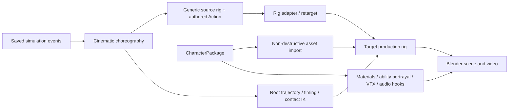

# Character packages and production asset integration

CharacterPackage is the presentation boundary between a saved fight and a visible Blender character. Combat statistics, AI choices, hit success, damage, and outcomes remain outside this package.



## Package layout

```text
assets/characters/<character_id>/
├── manifest.json
├── model/
├── rig_adapter.json
├── materials/
├── animations/
├── abilities/
├── vfx/
├── audio/
└── metadata/
```

The manifest records the visible model and armature, scale and axes, rest pose, default materials, combat style, generic animation compatibility, character-specific clips and overrides, presentation abilities, VFX, and attachment points.

## Import behavior

The Blender importer supports `.blend`, `.fbx`, `.glb`, and `.gltf`. It imports into a new character collection and creates separate trajectory and normalization roots. Scale and axis conversion are applied at wrapper objects, leaving source mesh data, weights, shape keys, constraints, twist bones, and materials intact. Source asset files are never overwritten.

The WWS source rig continues to own authored body motion and procedural world trajectory. The package rig receives mapped body rotations through the authoritative adapter. Root movement remains separate, so the same punch can occur while stationary, during a blitz, on a curve, or in the air. Contact IK timing follows the existing source controls.

For `.blend` packages, exact model object names are preferred. Blender may suffix imported object names to avoid collisions; the importer permits a type-based fallback only when the imported set contains exactly one unambiguous armature and the declared number of meshes.

## Rig mapping

`rig_adapter.json` must map every required role:

```text
root, pelvis, spine, chest, neck, head,
clavicle.L/R, upper_arm.L/R, forearm.L/R, hand.L/R,
thigh.L/R, shin.L/R, foot.L/R
```

Optional roles include toes and upper-arm, forearm, and thigh twist bones. Finger chains and corrective shape-key names have separate fields. Rotation offsets can describe rest-pose differences.

The suggestion tool recognizes common normalized patterns, including Mixamo-like names. It records candidates, reasons, and confidence. A close score is marked ambiguous and left unresolved. A proposal never replaces the authoritative adapter automatically.

```bash
wws suggest-rig-map assets/characters/<character_id> \
  --output assets/characters/<character_id>/rig_adapter.proposed.json
```

## Animation clips and overrides

An imported clip records:

- clip and action IDs;
- `.blend`, `.fbx`, `.glb`, or `.gltf` path;
- optional source armature and Blender Action name;
- source-rig adapter;
- anticipation, contact, and follow-through phases;
- root-motion policy;
- loop and mirror support.

The resolver checks a character-specific override first, then a character clip matching the action, then the generic 40-Action library when compatibility is declared. Imported Actions are copied into derived Blender data and tagged with their phase and root-motion metadata. The root-stripping utility lets WWS trajectories remain authoritative.

Example override:

```json
{
  "animation_clips": [
    {
      "clip_id": "hero_heavy_cross_v2",
      "action": "heavy_cross",
      "path": "animations/hero_heavy_cross.fbx",
      "source_armature": "Armature",
      "root_motion": "replace"
    }
  ],
  "custom_animation_overrides": {
    "heavy_cross": "hero_heavy_cross_v2"
  }
}
```

Custom action names such as `flight_blitz`, `teleport_dodge`, and `energy_charge` are allowed when a package supplies a clip and the cinematic action layer requests it.

## Ability portrayal

`AbilityDefinition` is presentation-only. It selects animation, startup/active/impact VFX, projectile objects, attachment points, camera preferences, environmental presentation, and sound hooks. Its schema fixes `authority` to `presentation` and `simulator_decides_outcome` to `true`. Outcome or success fields are rejected.

## Validation

```bash
wws validate-character assets/characters/<character_id>
wws validate-character assets/characters/<character_id> \
  --json reports/<character_id>-validation.json
```

The Python pass checks schemas, paths, safe package boundaries, scale, required animation coverage, attachment roles, overrides, and ability/VFX references. The Blender pass opens or imports the asset without saving it and checks the armature, mapped bones, skinned meshes, dimensions, material names, weight-group presence, corrective shape keys, and attachment bones.

`--skip-blender` performs schema checks only and emits an explicit warning that rig and deformation data were not inspected.

## Blender project usage

```bash
wws render-blender outputs/my_episode \
  --output outputs/my_blender_episode \
  --hybrid --scene-only \
  --character-a-package assets/characters/character_a \
  --character-b-package assets/characters/character_b
```

Generated Blender projects contain a versioned copy of both `scene.py` and `character_assets.py`. Their hashes are recorded in `blender_manifest.json`, so changing the runtime invalidates provenance checks.

## Current fixture

`v4_evaluation_a` and `v4_evaluation_b` are self-contained development packages extracted from V4. Their model files contain only a clean armature, the existing continuous V4 mesh, preserved materials, weights, and modifiers. They demonstrate real package import and derived working copies; they are not production assets and contain no new procedural body generation.

See `assets/characters/README.md` for the authored humanoid and licensing requirements for the next milestone.

