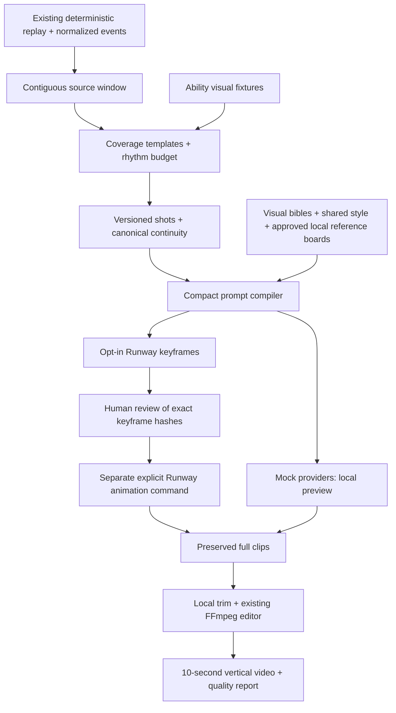

# Golden sequence workflow

The simulator determines canonical battle events. The cinematic renderer interprets them; generated visuals are not evidence for the outcome. This milestone preserves the engine and existing episode pipeline and adds one short, reviewable path to real media. **No paid generation was initiated during development.** The delivered video is a mock. Real image quality, identity consistency and motion quality remain unassessed until you supply references and explicitly run the paid commands.

## Architecture



The new code lives in `cinematic/golden`; the simulator never imports it. The existing image/video Protocols, event adapter, continuity tracker, asset cache, versioned manifest, storyboard renderer and FFmpeg editor are reused. Pygame remains available as a debugger. Shared episode schemas receive backward-compatible default fields and a short-sequence settings subclass. The old episode render/assemble entry points reject golden projects so they cannot bypass the stricter exact-keyframe checkpoint.

## Selected source and rhythm

The supplied seed-69 replay ends at **22.55 simulation seconds**, with Naruto winning by KO and Omni-Man at zero health. Automatic golden selection chooses the prior offensive exchange and highest-value finisher, **21.80–22.55**, retaining original moment and event IDs. This 0.75-second source interval is interpreted through multiple perspectives and dramatic holds to make a 10-second edit; it is not ten more seconds of combat.

| Shot | Coverage | Source moment | Edited duration |
| --- | --- | --- | ---: |
| 001 | Previous compact melee contact | moment-0039 | 1.2 s |
| 002 | Finisher setup, over shoulder | moment-0040 | 1.1 s |
| 003 | Single projectile launch, lateral tracking | moment-0040 | 1.1 s |
| 004 | Single decisive contact, impact insert | moment-0040 | 0.5 s |
| 005 | Effect dissipates over intact rooftop | moment-0040 | 1.3 s |
| 006 | Defeated Omni-Man reaction | moment-0040 | 2.4 s |
| 007 | Naruto victory hold | moment-0040 | 2.4 s |

This is a readable, decisive first test with different attack scales, form continuity, persistent wear and varied framing. No new destruction, anatomical injury or extra contact is added. The fixture energy projectile is a blue spiraling chakra sphere, not an inferred canonical named technique. The source's zero-health defeat is preserved; a specific fall or ground impact is not invented.

Templates support POWER_ATTACK, SPEED_BLITZ, HEAVY_COUNTER, TRANSFORMATION, FINISHER and DODGE. The deterministic golden director selects an applicable template and nearby exchange, then allocates exact frame counts while preserving short impacts and longer reactions. Coverage is camera interpretation, not extra simulation. Explicit time/moment selection is supported; absent an end bound, an explicit start includes up to three following simulation seconds.

## Install and run the local mock

From the repository root:

```bash
python3 -m venv .venv  # skip if using the delivered environment
source .venv/bin/activate
python -m pip install -e '.[dev,video,runway]'
wws golden-sequence outputs/naruto_vs_omniman_mock_demo \
  --output outputs/golden_sequence --duration 10 --shots 7 --mock
```

Output: `outputs/golden_sequence/final/golden_sequence.mp4`, 720 × 1280, 30 fps, 300 frames, ten seconds. All media is local. This command records a draft preview override; it does not claim human keyframe approval. Repeating the same command reuses the existing project/cache. Use a fresh `--output` for changed direction/settings. Omit `--mock` to plan and storyboard without making clips.

The supplied parent project can also be reconstructed locally from its saved replay:

```bash
wws direct outputs/naruto_vs_omniman_mock_demo/simulation.json \
  --duration 60 --shots 24 --output outputs/seed69-plan
wws golden-sequence outputs/seed69-plan --output outputs/alternate-golden \
  --start-time 10.2 --end-time 11.2 --duration 10 --shots 7
```

`--start-moment moment-0021 --end-moment moment-0023` is an alternative for the supplied parent; inspect that parent's `moments.json` for IDs. Golden mode requires explicit ability visuals for the matchup. This milestone supplies Naruto and Omni-Man, not automatic mappings for every fighter.

## Provide and approve references

Use the repository's `references/` directory:

```text
references/
  naruto/front.png
  naruto/three-quarter.png
  naruto/side.png             (optional)
  naruto/action.png           (optional)
  omniman/front.png
  omniman/three-quarter.png
  omniman/side.png            (optional)
  omniman/action.png          (optional)
  style/style-01.png
  arena/rooftop.png
```

PNG/JPEG/WebP accepted; minimum 256 × 256; maximum four character views each and four style/arena images combined. Use consistent versions and costumes, clearly legible faces and silhouettes, and one lighting/arena direction. All inputs are local and user supplied; nothing is scraped. Visual mappings are development fixtures until reviewed.

```bash
wws golden-references outputs/golden_sequence --directory references
```

Inspect `outputs/golden_sequence/references/packed/naruto.jpg`, `omniman.jpg`, and `look.jpg`, then explicitly approve:

```bash
wws golden-references outputs/golden_sequence --approve
```

Multiple views are packed into two identity boards plus one style/arena board to fit the model's three-reference limit. Solo shots receive only their character board plus the look board. The prompt uses matching reference tags. Originals and packed boards are SHA-256 checked before each request. A different reference pack requires a new golden project; in-place mutation is rejected.

## Configure credentials without putting them in project files

Create your API credential in your Runway developer account. In the same terminal used for generation, on macOS/zsh:

```bash
read -s 'RUNWAYML_API_SECRET?Runway API secret: '
export RUNWAYML_API_SECRET
```

The terminal hides the entered secret. The application reads only `RUNWAYML_API_SECRET`, and only when Runway is explicitly selected. It never writes the key, raw request bodies, signed output URLs or raw provider exception bodies into the manifest. `.env` files are ignored by version-control rules; the application does not automatically load them. Run `unset RUNWAYML_API_SECRET` when finished. Never paste the key into a prompt, report or source file.

## Cost estimate BEFORE paid use

```bash
wws golden-estimate outputs/golden_sequence
```

Default seven-shot first pass:

| Generation | Count | Rate | Estimated USD |
| --- | ---: | ---: | ---: |
| gen4_image_turbo | 7 keyframes | $0.02 each | $0.14 |
| gen4_turbo | 7 × 5 seconds | $0.05/second | $1.75 |
| Total | 14 tasks | | **$1.89 before tax** |

Prices were checked on 2026-09-06. Runway charges $0.01 per credit; image turbo uses two credits/image and video turbo five credits/second. This excludes tax, retries, additional versions and any account funding minimum. Recheck [official pricing](https://docs.dev.runwayml.com/guides/pricing/) before paid use.

**Use `--max-cost 2.00` as the cumulative application generation cap**, including previous, failed-with-unknown-cost and unresolved tasks. This is not a separate $2 allowance per command. Every planned task is checked before submission; prior unknown charges remain reserved conservatively. The cap uses the local verified price table, not a provider-enforced billing ceiling or a guarantee against future pricing changes. Unknown models are rejected until their cost contract is added.

Gen-4 Turbo's documented generation lengths are **5 or 10 seconds**, so this implementation uses five-second full clips and trims them locally. It does not submit unsupported two-second Gen-4 Turbo requests. [Runway duration documentation](https://help.runwayml.com/hc/en-us/articles/37327109429011-Creating-with-Gen-4-Video)

Alternate implemented models are `gen4_image` at the 720p price and `gen4.5` with integer 2–10-second generations. Explicit `--model` is supported, but these defaults should be evaluated first. Real generation is currently restricted to 720 × 1280 portrait. Final assembly uses 30 fps by default.

## Generate keyframes, then STOP for human review

Only run after reviewing the references, prompts and estimate:

```bash
wws golden-keyframes outputs/golden_sequence \
  --provider runway --real --model gen4_image_turbo --max-cost 2.00
```

This command only generates images, writes task IDs/cost records, and rebuilds `contact-sheet.png`. It never starts video. Review individual files in `keyframes/` as well as the contact sheet for identity, hair, costume, form, left/right staging, ability shape, one-contact semantics and arena lighting.

To regenerate exactly one keyframe, preserving other shots and retaining its old asset/version:

```bash
wws golden-keyframes outputs/golden_sequence --shot shot-003 --regenerate \
  --provider runway --real --model gen4_image_turbo --max-cost 2.00
```

This invalidates only that shot's keyframe approval and clip. It costs another image task if within the remaining cap. Existing successful assets are reused unless explicitly regenerated; changing `--model` alone does not replace a cached successful image. Use a fresh golden project for broad style/reference changes.

Approve after review:

```bash
wws approve-keyframes outputs/golden_sequence --all
# Or individually:
wws approve-keyframes outputs/golden_sequence --shot shot-003
# To reject:
wws approve-keyframes outputs/golden_sequence --shot shot-003 --reject
```

Approval binds to the exact current image bytes and shot version. Editing or replacing the image invalidates it. Legacy storyboard approval alone cannot authorize real video.

## Animate approved frames, preserve full clips, assemble

This is a separate explicit paid command:

```bash
wws golden-animate outputs/golden_sequence \
  --provider runway --real --model gen4_turbo \
  --generation-seconds 5 --max-cost 2.00
wws golden-assemble outputs/golden_sequence
```

Add `--shot shot-003` to animate only that approved shot. Real mode requires approved real keyframes; `--allow-draft` is forbidden. Mock and real full clips cannot be mixed into a supposedly real complete sequence.

Full clips remain in `clips/*-runway-full.mp4`; assembly never overwrites them. Local edit clips are trimmed separately. Select a better interval after watching the full clip:

```bash
wws golden-trim outputs/golden_sequence --shot shot-004 --in-seconds 1.2
wws golden-assemble outputs/golden_sequence
```

Trimming/assembly is free of generation calls. The trim must fit the full clip. FPS conversion happens before exact-frame trimming to prevent dropped short-cut frames. The existing editor supplies hard cuts, selective impact effects, subtitle timing and local placeholder sound cues. No TTS is integrated.

## Failure recovery and spending provenance

The official `runwayml` SDK is configured with automatic POST retries disabled. Task IDs, shot versions, model, request fingerprints, timestamps, reservations, provider-reported cost and output hashes live in `manifest.json`. The project has an exclusive process lock, with durable ledger writes before submission.

- Rerun the same command after polling timeout or download failure: it resumes the recorded task; it does not submit another paid generation. Up to three failed task GETs are retried with backoff; progress logs show task state/ID only.
- A successful task is cached. Lost or damaged local output is re-downloaded from that task where available. Provider output retention may limit recovery; a new paid task is never silently substituted.
- A known FAILED/CANCELLED task requires explicit `--retry-failed`, still subject to the cumulative cap.
- If a submission response is lost, the task may already be billed. The command records UNKNOWN/SUBMITTING and will not resubmit. Find its exact task ID in your Runway account and attach it without a new API request:

```bash
wws golden-link-task outputs/golden_sequence \
  --job <job_key_from_manifest> --task-id <exact_runway_task_id>
```

Then rerun the original generation command to poll it. If its outcome cannot be established, leave the reservation intact; do not assume a retry is free. Actual costs are populated only when returned by the provider; unresolved costs stay reserved.

## Art direction, files and limitations

`AbilityVisualProfile` supplies explicit action/windup/movement/impact/effect semantics, form requirements, pose guidance and constraints without touching stats. The shared `EpisodeStyleProfile` specifies stylized 3D comic/anime, cel shading, semi-realistic materials, dramatic rim light, expressive faces and readable silhouettes. No living artist is referenced. Character identity comes from approved local references, not invented canonical naming.

`prompt_debug.json` exposes compiled components, reference tags, source IDs and UTF-16 length. Prompts fail clearly above the verified 1,000-unit limit instead of silently dropping identity or outcome constraints. Motion prompts focus on action and camera movement. Pose guidance and reference asset paths remain in the visual profile for review; compiled shots select the relevant action phase rather than pasting every verbose profile field.

Each golden project retains `simulation.json`, `events.json`, `moments.json`, `shot_list.json`, `continuity.json`, `visual_profiles.json`, `ability_visuals.json`, `arena_visual.json`, `style.json`, `prompt_debug.json`, `references/`, `storyboard/`, `keyframes/`, `clips/`, `audio/`, `final/`, `contact-sheet.png`, `manifest.json` and `quality_report.md`.

The quality report records camera variety, source continuity, human approval state, failures/retries and cost per shot. Write real visual observations in `quality_notes.md`; automatic report refreshes preserve that file. No prompts are declared successful until you judge real outputs.

Current limits: live service acceptance and visual quality are untested; identity boards may need iteration; provider seeds are request reproducibility aids, not a guarantee of identical generative output. The process lock currently uses POSIX `fcntl` (macOS/Linux); Windows requires a lock adapter. Only Naruto/Omni-Man have golden visual mappings. The mock silhouettes validate composition/timing only. The short film should be judged before expanding to a full episode.

## Validation and next milestone

Run `python -m pytest -q`. Golden tests block network sockets and exercise the official SDK with HTTPX MockTransport: image/video request serialization, references, opt-in/caps, approval, versions, ambiguity recovery, failed-task retries, cached output retrieval, coverage/rhythm, provenance and actual local FFmpeg assembly. They do not consume API credits.

The next milestone is the user-initiated seven-keyframe review and ten-second real film. Evaluate identity/costume consistency, single-contact action, readable motion, camera composition, correct source outcome and editing handles. Refine only failing shots, record cost and best prompts, then decide whether to attempt 30–60 seconds.
